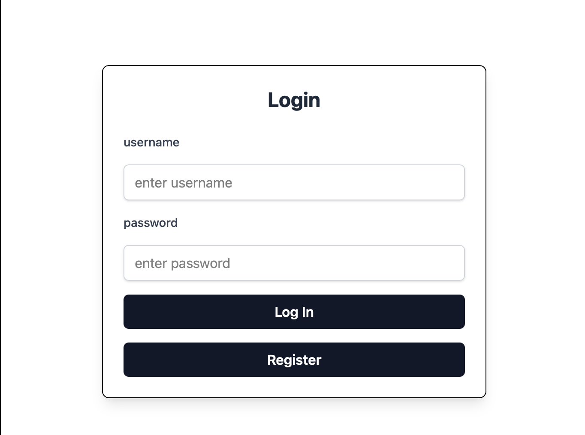
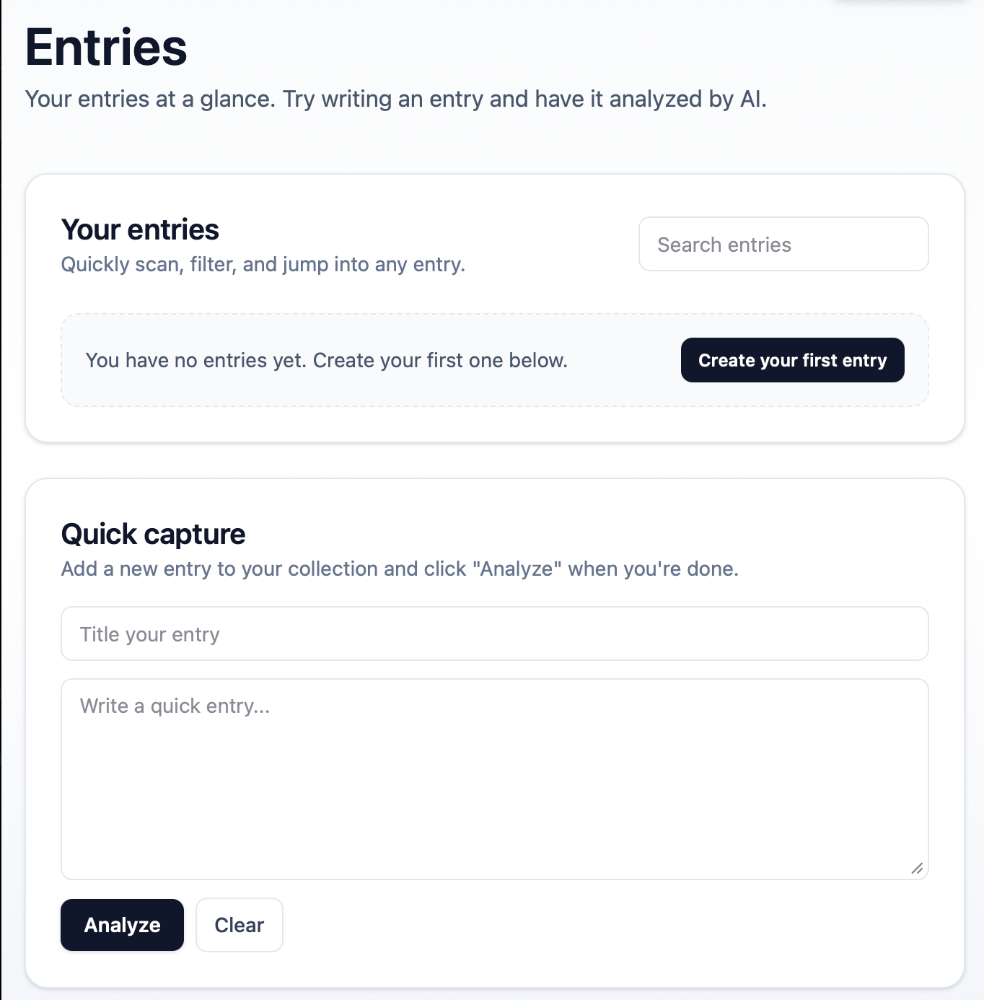
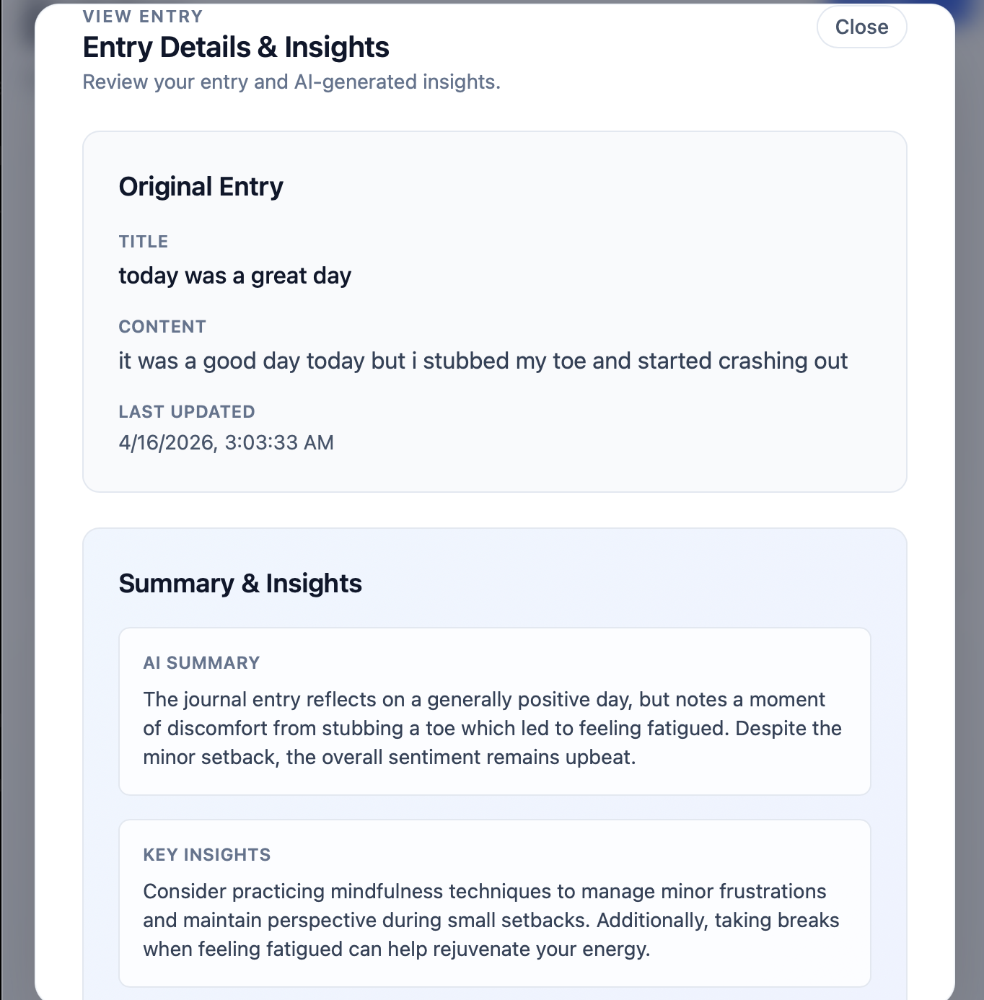

# AI Reflection & Insight App
this is my first personal project that i actually finished. it was originally supposed to be a personal dashboard, but then i pivoted because it was boring and apparently "AI" makes investors drool over you. it's kinda messy and simple but at least it works.

## Link
<https://aireflection.vercel.app>

## Screenshots

## Tech Stack
- **frontend** - react, vite, tailwind, react query, zustand, axios
- **backend** - springboot, spring security, spring data jpa, jwt
- **database** - supabase (postgresql), h2 (local dev)
- **deployment** - vercel (frontend), render (backend)

## Features
- user registration and login with JWT auth
- protected routes for authenticated users
- create, update, view, and delete journal entries
- AI-powered analysis for each entry:
    - summary
    - themes
    - tone
    - insights

## How to run locally
#### 1) Clone
- git clone ***<https://github.com/a1bnaz/AI-Reflection-Insight-Web-App>***
- cd AIInsightandReflectionApp

#### 2) Backend setup
- cd backend
- cp .env.example .env (if you create one)
- ./mvnw spring-boot:run
##### backend runs on *http://localhost:8080*

#### 3) Frontend setup
- cd ..front/end
npm install
npm run dev
##### frontend runs on *http://localhost:5173*

## Environment Variables
##### backend (located at *backend/.env*)
JWT_SECRET=your_jwt_secret\
OPENAI_API_KEY=your_openai_key\
DB_USER=your_db_user\
DB_PASSWORD=your_db_password\
DB_HOST=your_db_host\
DB_PORT=5432\
DB_NAME=your_db_name\
SPRING_PROFILES_ACTIVE=dev

##### frontend (located at frontend/.env.production)
VITE_API_URL=https://your-backend-url/api

## Development vs. Production
- default backend profile is *dev* unless **SPRING_PROFILES_ACTIVE** is set otherwise
- *dev* uses local H2 database for easier local testing
- *prod* uses postgresql environment variables
- frontend uses vite proxy in dev and **VITE_API_URL** in prod

## Caveat!!
- since i'm using Render's free tier, the backend cold start can take ~30-45 seconds on the first request (the app isn't broken, probably...)
- a login loading overlay is shown to keep users informed during wake up

## What I learned
- i built a full stack auth with JWT and protected routes
- managing async APi state with react query
- profile-based config. in springboot
- handling deployment differences between local/dev/prod
- actually finishing a project!!